# 🌱 FaunaPulse - AI-Driven IoT system for non-invasive soil fauna monitoring via bioacoustic and environmental sensing.

## 📌 Project Description

**FaunaPulse** is an AI- and IoT-powered system designed to **non-invasively monitor the biological activity of underground soil organisms** in real time using bioacoustic signals and environmental data. The system empowers farmers to remotely assess soil vitality, detect anomalies in soil ecosystems, and support sustainable agricultural practices.

At its core, **piezoelectric discs** detect subtle vibrations generated by soil-dwelling organisms. A trained **deep learning model** then classifies these acoustic signals into activity levels:

* **High**: Indicates diverse and active fauna
* **Low**: Suggests sparse or absent soil life

Simultaneously, the system gathers essential environmental metrics via sensors:

* **SHT30 Sensor Probe** – Soil Temperature and Humidity
* **Capacitive Analog Sensor** – Soil Moisture

All data is securely transmitted to a cloud backend (e.g., **Supabase** or **Firebase**) and displayed in a **user-friendly mobile app**. When critical conditions are detected (e.g., low fauna activity, poor moisture), **real-time alerts** are triggered via email and in-app notifications. FaunaPulse enables proactive soil health management and ecological sustainability.

---

## 🔗 GitHub Repository

📁 [GitHub Repository](https://github.com/SammyGbabs/FaunaPulse-Capstone-Project)

---

## 🛠️ Running the Project

### Prerequisites

* Python 3.8+
* Flutter SDK (for running the mobile app)

---

### 🐍 Backend (FastAPI)

1. **Clone the repository:**

   ```bash
   git clone https://github.com/SammyGbabs/FaunaPulse-Capstone-Project
   cd FaunaPulse-Capstone-Project
   ```

2. **Navigate to the API directory:**

   ```bash
   cd API
   ```

3. **(Optional) Set up a virtual environment:**

   ```bash
   python -m venv venv
   venv\Scripts\activate  # On Windows
   source venv/bin/activate  # On Mac/Linux
   ```

4. **Install dependencies:**

   ```bash
   pip install -r requirements.txt
   ```

5. **Run the FastAPI server:**

   ```bash
   uvicorn API.main:app --reload --host localhost --port 8000
   ```

> 🌍 Deployed API: See `API/README.md` for the live Render link.

---

### 📱 Mobile App (Flutter)

1. **Navigate to the mobile app directory:**

   ```bash
   cd Mobile App
   ```

2. **Install dependencies:**

   ```bash
   flutter pub get
   ```

3. **Run the application:**

   * Open `lib/main.dart` in your preferred editor
   * Run using:

     ```bash
     flutter run
     ```

4. **To build APK for Android:**

   ```bash
   flutter build apk
   ```

   Or download the APK directly:

   👉 [Download APK](https://drive.google.com/file/d/10-7qCPyJRSdM_iNmgaKdzn-fn-nO1oh6/view?usp=sharing)

---

## 📸 App Screenshots

* 🧠 Info Pages: This section contains general information about soil health and how FaunaPulse works.

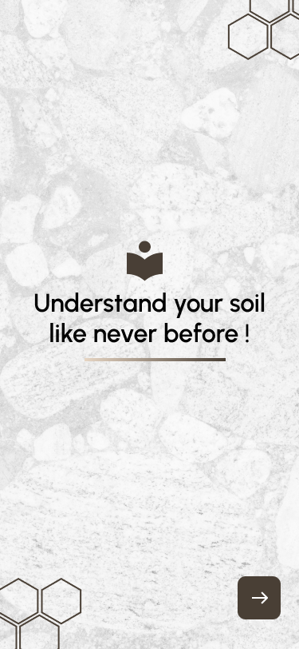
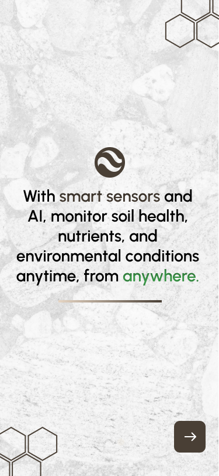
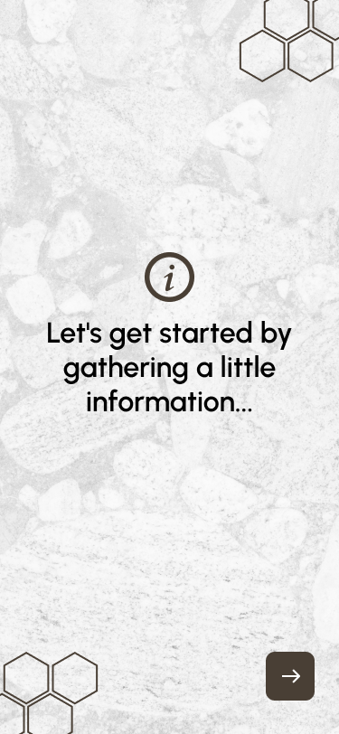

* 🔐 Sign Up / Sign In: Secure authentication pages for new and returning users.
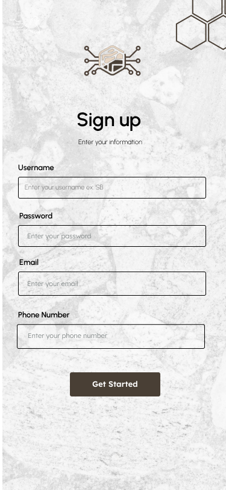
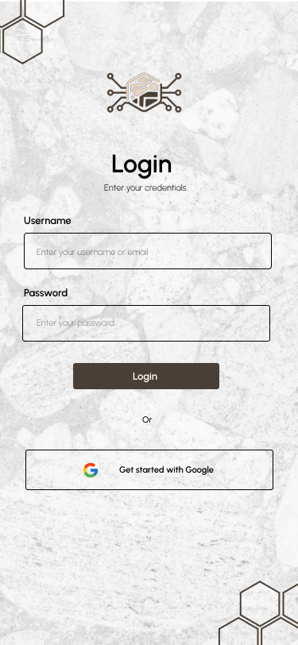

* 📊 Dashboard: A real-time overview of soil fauna data including bioacoustic activity and sensor readings.
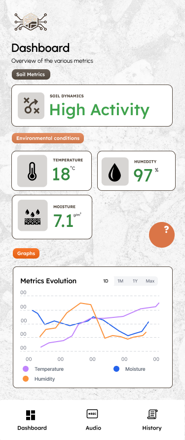
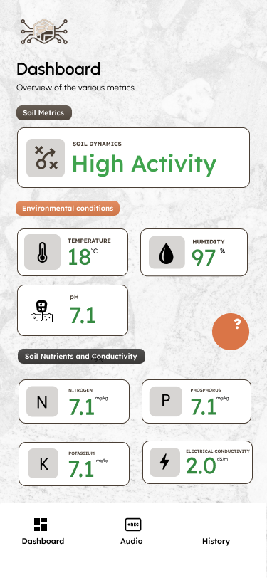

* ⬆️ Manual Upload: Manually upload audio or sensor data for analysis.
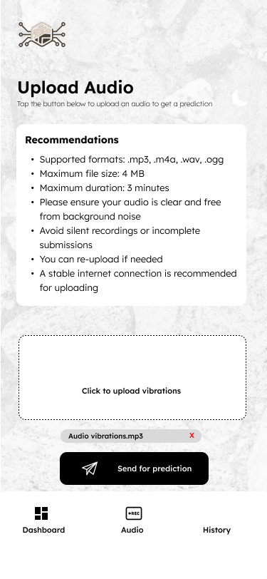
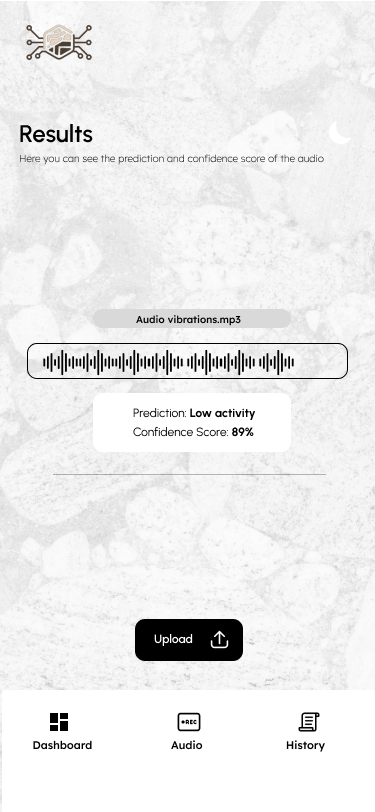

* 🤖 Chatbot: An AI-powered assistant that answers user queries about soil health and app usage.
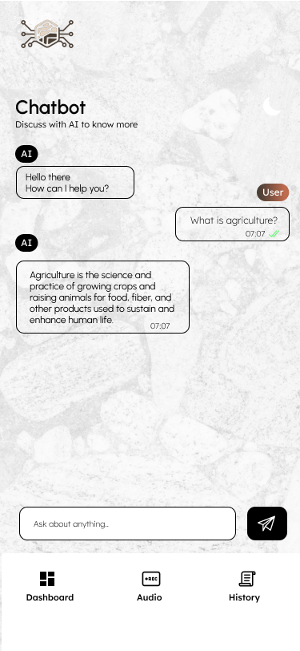

🔔 Push Notification: Real-time alerts to notify users of critical soil conditions like low fauna activity or abnormal moisture levels.
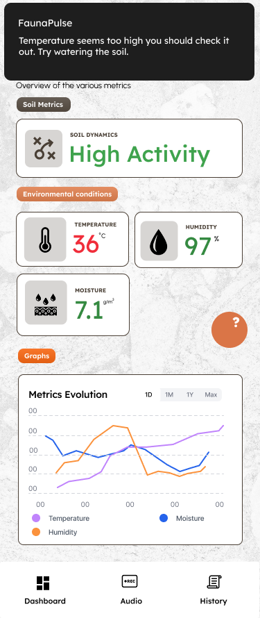

* 🕓 History: Displays historical logs of soil activity, alerts, and system responses.
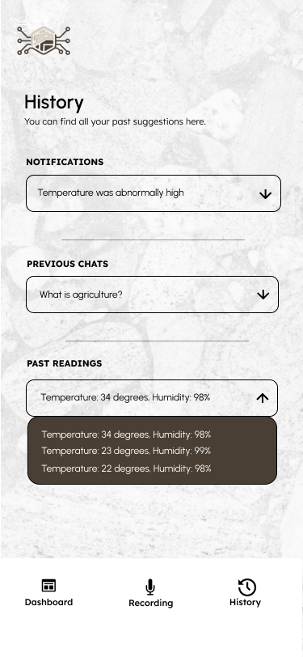

---

## 🎨 Design Prototype

🎨 [Figma File](https://www.figma.com/design/E711yGypzSbVb67xeNCud2/Fauna-Pulse?node-id=0-1&t=7Ms4QG1h1jL6bYI2-1)

---

## 🎥 Demo

🎬 [Watch Demo Video](https://drive.google.com/file/d/1RqHnKHlgAsEGxp39k1VT_13tz3vFybnA/view?usp=sharing)

---

## 🚀 Deployment Plan

The **FaunaPulse** system is designed to be fully operational in real-world agricultural environments. The deployment architecture includes several integrated components: a deep learning model, a FastAPI backend, a mobile frontend, and sensor hardware. Here's how each piece is deployed:

---

### 1. 🧠 Model Deployment (Hugging Face)

- The trained deep learning model, responsible for classifying bioacoustic data (high vs low fauna activity), will be hosted on **Hugging Face Spaces**.
- This ensures scalability, version control, and easy integration with the FastAPI backend via API calls.
- Continuous monitoring and retraining of the model can be managed via Hugging Face's CI/CD tools or GitHub Actions.

<!-- 🔗 [View or access the model on Hugging Face](https://huggingface.co/spaces/...) -->

---

### 2. ⚙️ Backend Deployment (FastAPI + Render)

- The backend server is built using **FastAPI** and deployed on **Render**, a reliable and cost-effective platform for web services.
- The backend handles:
  - Receiving and processing sensor/audio data.
  - Forwarding audio to the ML model API.
  - Managing user authentication and alert logic.
  - Interfacing with the Supabase/Firebase database.

🔗 The live API URL can be found in the [API directory README](https://github.com/SammyGbabs/FaunaPulse-Capstone-Project/tree/main/API).

---

### 3. 📱 Mobile App Deployment (Flutter)

- The mobile app is developed in **Flutter**, ensuring cross-platform compatibility (Android).
- Features include:
  - Real-time dashboard.
  - Chatbot support.
  - History logs.
  - Manual data uploads.
  - Push notifications and alerts.
- The APK is available for direct download or can be built via:

```bash
flutter build apk
````

📲 [Download APK](https://drive.google.com/file/d/10-7qCPyJRSdM_iNmgaKdzn-fn-nO1oh6/view?usp=sharing)

---

### 4. 📡 Hardware Deployment (IoT + Sensor Network)

* Sensors used:

  * **Piezo Discs** – for capturing soil vibrations.
  * **SHT30** – for soil temperature and humidty.
  * **Capacitive analog** – for soil moisture.
* Microcontroller (e.g., ESP32-C3) reads sensor values and transmits data via Wi-Fi to the FastAPI endpoint.
* Power: Battery-operated setup for remote farms.
* Hardware is enclosed in weather-resistant casing for durability in field conditions.

---

### 5. 🔒 Database & Authentication (Supabase or Firebase)

* **Supabase** (or **Firebase** as an alternative) is used to:

  * Store sensor data, user records, and historical logs.
  * Manage user sessions and secure authentication.
  * Provide real-time syncing for dynamic data updates.

---

### 6. 🔔 Notification System

* The system leverages:

  * **Firebase Cloud Messaging (FCM)** for in-app push notifications.
  * **SendGrid** or **SMTP** for automated email alerts.
* Notifications are triggered when:

  * Fauna activity drops below expected thresholds.
  * Soil moisture/temperature/humidity exceeds healthy ranges.

---


## 📩 Contact

For questions or collaborations, feel free to reach out:

**Babalola Samuel**
📧 [s.babalola@alustudent.com](mailto:s.babalola@alustudent.com)
🔗 [LinkedIn](https://www.linkedin.com/in/sammybabs/)

