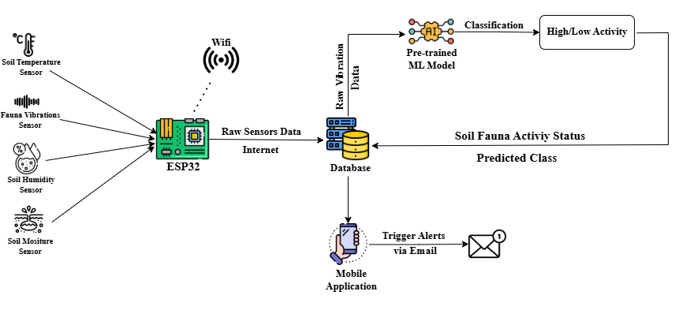
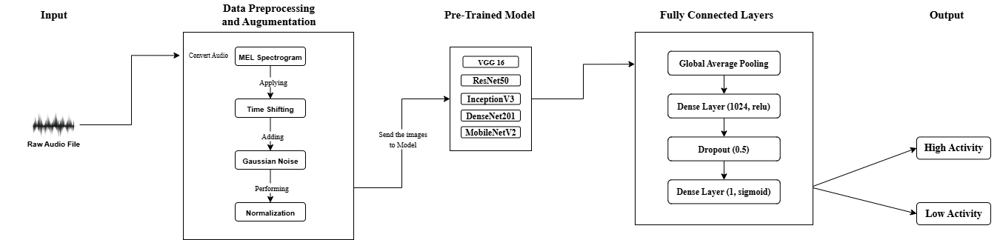
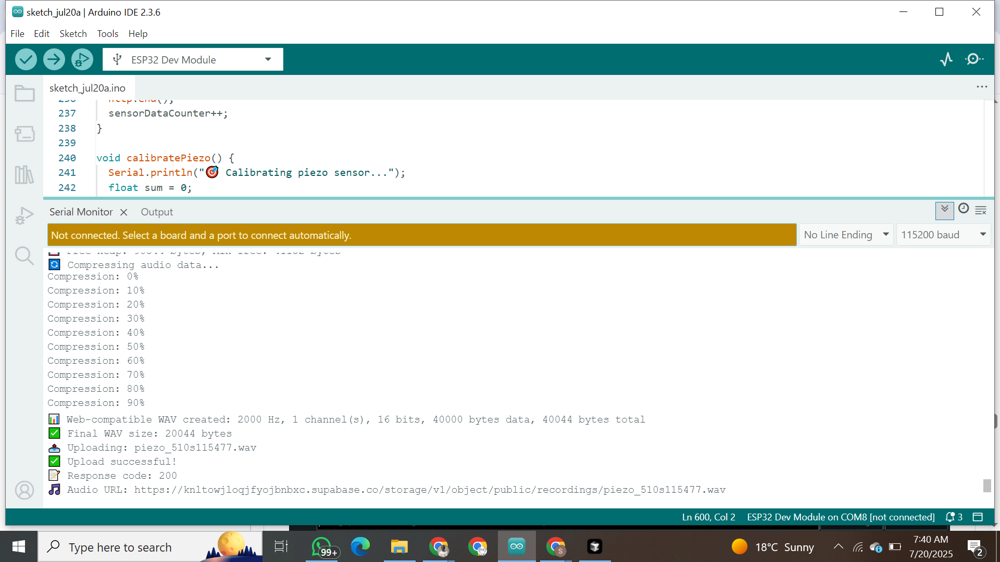
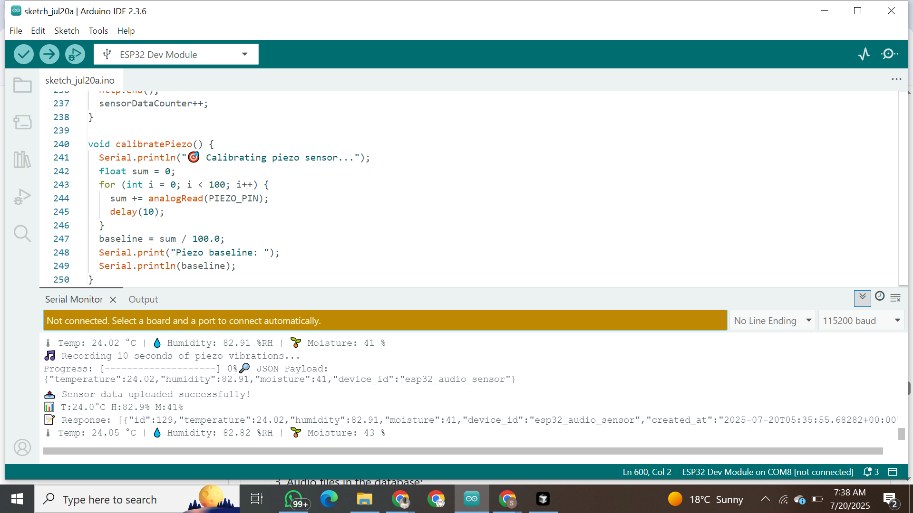
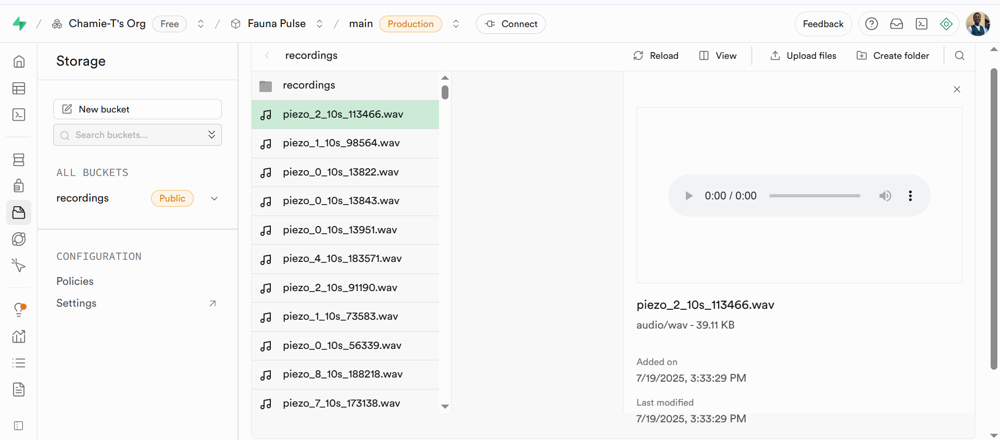
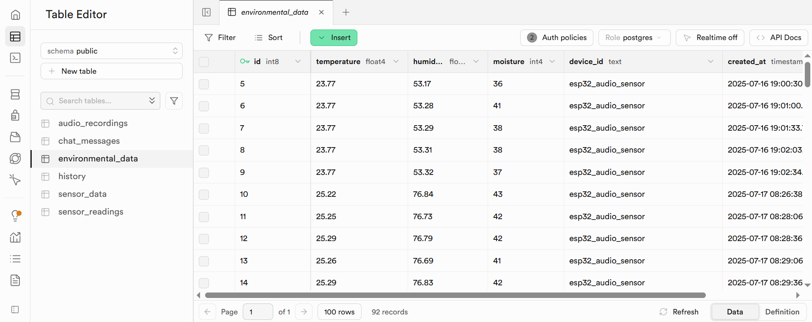
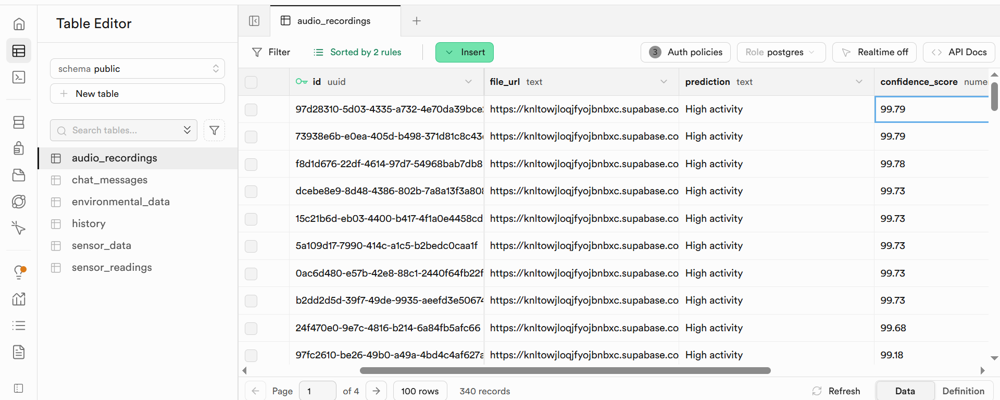
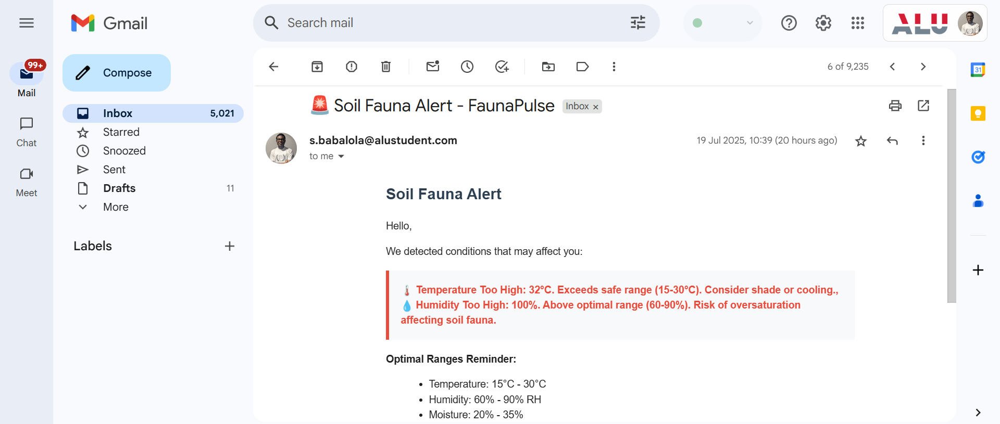

# 🌱 FaunaPulse - AI-Driven IoT system for non-invasive soil fauna monitoring via bioacoustic and environmental sensing.

## 📌 Project Description

**FaunaPulse** is an AI- and IoT-powered system designed to **non-invasively monitor the biological activity of underground soil organisms** in real time using bioacoustic signals and environmental data. The system empowers farmers to remotely assess soil vitality, detect anomalies in soil ecosystems, and support sustainable agricultural practices.

At its core, **piezoelectric discs** detect subtle vibrations generated by soil-dwelling organisms. A trained **deep learning model** then classifies these acoustic signals into activity levels:

* **High**: Indicates diverse and active fauna
* **Low**: Suggests sparse or absent soil life

Simultaneously, the system gathers essential environmental metrics via sensors:

* **SHT30 Sensor Probe** – Soil Temperature and Humidity
* **Capacitive Analog Sensor** – Soil Moisture

All data is securely transmitted to a cloud backend (**Supabase**) and displayed in a **user-friendly mobile app**. When critical conditions are detected (e.g., low fauna activity, poor moisture), **real-time alerts** are triggered via email and in-app notifications. FaunaPulse enables proactive soil health management and ecological sustainability.

---

## 🎥 Demo

Below is the demo video showcasing all the features, functionalities and workflow of FaunaPulse:

🎬 [Watch Demo Video](https://drive.google.com/file/d/1p_h4teNflOr7M_uhvJOiIGWPcWOHkxIT/view?usp=sharing)

---

## 🔗 GitHub Repository

📁 [GitHub Repository](https://github.com/SammyGbabs/FaunaPulse-Capstone-Project)

---

## 🛠️ Running the Project

### Prerequisites

* Python 3.8+
* Flutter SDK (for running the mobile app)

---

### 🐍 Backend (FastAPI)

1. **Clone the repository:**

   ```bash
   git clone https://github.com/SammyGbabs/FaunaPulse-Capstone-Project
   cd FaunaPulse-Capstone-Project
   ```

2. **Navigate to the API directory:**

   ```bash
   cd API
   ```

3. **(Optional) Set up a virtual environment:**

   ```bash
   python -m venv venv
   venv\Scripts\activate  # On Windows
   source venv/bin/activate  # On Mac/Linux
   ```

4. **Install dependencies:**

   ```bash
   pip install -r requirements.txt
   ```

5. **Run the FastAPI server:**

   ```bash
   uvicorn API.main:app --reload --host localhost --port 8000
   ```

> 🌍 Deployed API: See `API/README.md` for the live Render link.

---

### 📱 Mobile App (Flutter)

1. **Navigate to the mobile app directory:**

   ```bash
   cd Mobile App
   ```

2. **Install dependencies:**

   ```bash
   flutter pub get
   ```

3. **Run the application:**

   * Open `lib/main.dart` in your preferred editor
   * Run using:

     ```bash
     flutter run
     ```

4. **To build APK for Android:**

   ```bash
   flutter build apk
   ```

   Or download the APK directly:

   👉 [Download APK](https://drive.google.com/file/d/1Egjc2gORn48z1I4eIjPylhnCNxhMr4gn/view?usp=sharing)

---

## 🏗️ System Architecture

The diagram below illustrates the overall system architecture of FaunaPulse, showing how the IoT devices, backend, machine learning model, and user interfaces interact to enable real-time soil monitoring and alerting.



---

## 🧠 Model Architecture

The following diagram presents the architecture of the deep learning model used for classifying soil bioacoustic signals. It highlights the key layers and data flow from input MEL spectrograms to the final activity prediction.



---

## 🖥️ Circuit Diagram

Below is the screenshot of my circuit diagram.


---

## 📸 App Screenshots

* 🧠 Info Pages: This section contains general information about soil health and how FaunaPulse works.


* 🔐 Sign Up / Sign In: Secure authentication pages for new and returning users.


* 📊 Dashboard: A real-time overview of soil fauna bioacoustic activity and environmental readings.


* ⬆️ Manual Upload: Manually upload audio or sensor data for analysis.


* 🤖 Chatbot: An AI-powered assistant that answers user queries about soil health and app usage.


🔔 Push Notification: Real-time alerts to notify users of critical soil conditions like low fauna activity or abnormal moisture levels.


* 🕓 History: Displays historical logs of soil activity, alerts, and system responses.


---

## 🔄 Project Workflow (From IoT to Supabase)

1. **Recording of the audio**
   

2. **Sending the audio to the database**
   

3. **Capturing and sending of environmental data to database**
   

4. **Audio files in the database**
   

5. **Recorded audio files stored in the database**
   

6. **Environmental data in the database**
   

7. **Predictions made by the model based on the audio data received**
   

8. **Email Notification**
   

---

## 🎨 Design Prototype

🎨 [Figma File](https://www.figma.com/design/E711yGypzSbVb67xeNCud2/Fauna-Pulse?node-id=0-1&t=7Ms4QG1h1jL6bYI2-1)

## 🚀 Deployment Plan

The model was deployed on the Hugging Face platform, and the entire project was tested in a real farm located in Nyamata. In this project, vibration levels from the soil were recorded as audio over a period of time. These audio recordings were then converted into MEL spectrogram images and passed through the model to classify the biological activity in the soil. Temperature and humidity data were collected using the SHT30 sensor, while a capacitive analog sensor was used to measure soil moisture. All readings were displayed in real-time on a dashboard. Whenever the activity of soil-dwelling organisms or the environmental conditions were not suitable, alerts were sent through email and mobile push notifications. The system continues to be improved by updating the model with new data, helping it become more accurate and effective over time.

---

## 🏁 Conclusion

FaunaPulse demonstrates the power of integrating AI, IoT, and real-time data analytics to address critical challenges in sustainable agriculture such as decline in agricultural productivity, and in climate change including loss of soil biodiversity, and soil degradation. By enabling non-invasive monitoring of soil health, the system empowers farmers with actionable insights, helping them make informed decisions to improve crop yield and ecological balance. The project’s modular design allows for continuous improvement, with the potential to incorporate more advanced sensors, predictive analytics, and broader deployment in diverse agricultural settings. As the system evolves, FaunaPulse aims to become an indispensable tool for promoting soil vitality,  environmental stewardship, and food security worldwide.

---

## 📩 Contact

For questions or collaborations, feel free to reach out:

**Babalola Samuel**
📧 [s.babalola@alustudent.com](mailto:s.babalola@alustudent.com)
🔗 [LinkedIn](https://www.linkedin.com/in/sammybabs/)

