# 🌱 FaunaPulse - AI-Driven IoT system for non-invasive soil fauna monitoring via bioacoustic and environmental sensing.

## 📌 Project Description

**FaunaPulse** is an AI- and IoT-powered system designed to **non-invasively monitor the biological activity of underground soil organisms** in real time using bioacoustic signals and environmental data. The system empowers farmers to remotely assess soil vitality, detect anomalies in soil ecosystems, and support sustainable agricultural practices.

At its core, **piezoelectric discs** detect subtle vibrations generated by soil-dwelling organisms. A trained **deep learning model** then classifies these acoustic signals into activity levels:

* **High**: Indicates diverse and active fauna
* **Low**: Suggests sparse or absent soil life

Simultaneously, the system gathers essential environmental metrics via sensors:

* **SHT30 Sensor Probe** – Soil Temperature and Humidity
* **Capacitive Analog Sensor** – Soil Moisture

All data is securely transmitted to a cloud backend (e.g., **Supabase** or **Firebase**) and displayed in a **user-friendly mobile app**. When critical conditions are detected (e.g., low fauna activity, poor moisture), **real-time alerts** are triggered via email and in-app notifications. FaunaPulse enables proactive soil health management and ecological sustainability.

---

## 🎥 Demo

Below is the demo video showcasing all the features, functionalities and workflow of FaunaPulse:

🎬 [Watch Demo Video](https://drive.google.com/drive/folders/1ysQDpDNbC_lDK28U8dfWJQWe8rR3-qZW?usp=drive_link)

---

## 🔗 GitHub Repository

📁 [GitHub Repository](https://github.com/SammyGbabs/FaunaPulse-Capstone-Project)

---

## 🛠️ Running the Project

### Prerequisites

* Python 3.8+
* Flutter SDK (for running the mobile app)

---

### 🐍 Backend (FastAPI)

1. **Clone the repository:**

   ```bash
   git clone https://github.com/SammyGbabs/FaunaPulse-Capstone-Project
   cd FaunaPulse-Capstone-Project
   ```

2. **Navigate to the API directory:**

   ```bash
   cd API
   ```

3. **(Optional) Set up a virtual environment:**

   ```bash
   python -m venv venv
   venv\Scripts\activate  # On Windows
   source venv/bin/activate  # On Mac/Linux
   ```

4. **Install dependencies:**

   ```bash
   pip install -r requirements.txt
   ```

5. **Run the FastAPI server:**

   ```bash
   uvicorn API.main:app --reload --host localhost --port 8000
   ```

> 🌍 Deployed API: See `API/README.md` for the live Render link.

---

### 📱 Mobile App (Flutter)

1. **Navigate to the mobile app directory:**

   ```bash
   cd Mobile App
   ```

2. **Install dependencies:**

   ```bash
   flutter pub get
   ```

3. **Run the application:**

   * Open `lib/main.dart` in your preferred editor
   * Run using:

     ```bash
     flutter run
     ```

4. **To build APK for Android:**

   ```bash
   flutter build apk
   ```

   Or download the APK directly:

   👉 [Download APK](https://drive.google.com/file/d/1Egjc2gORn48z1I4eIjPylhnCNxhMr4gn/view?usp=sharing)

---

## 🖥️ Circuit Diagram

Below is the screenshot of my circuit diagram.

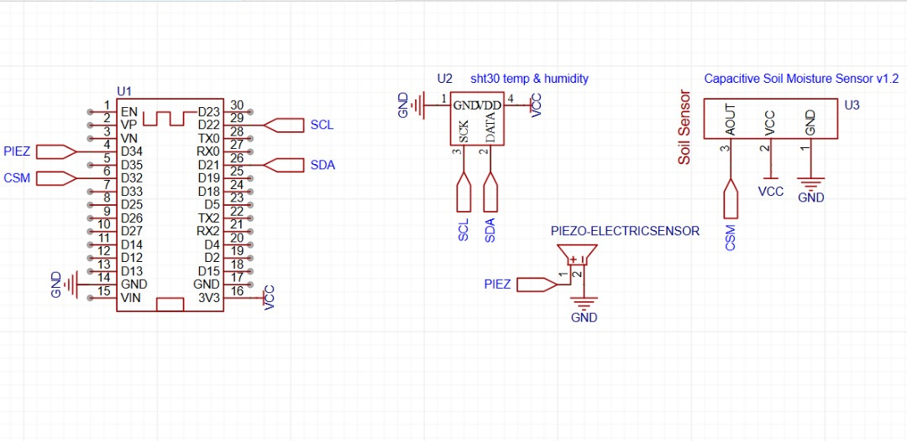

---

## 📸 App Screenshots

* 🧠 Info Pages: This section contains general information about soil health and how FaunaPulse works.
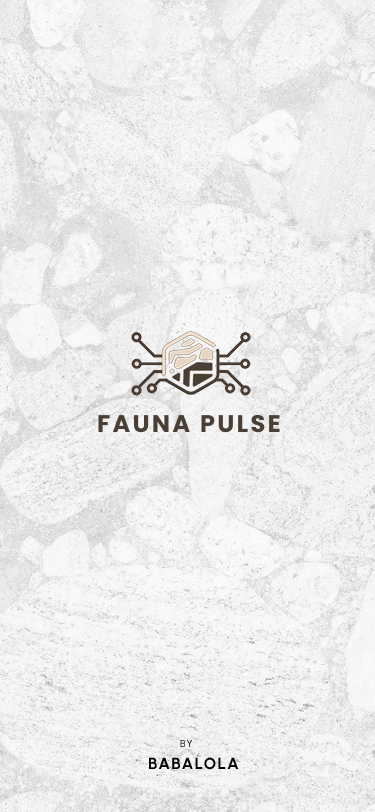
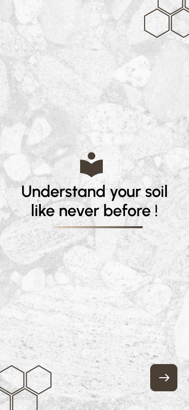
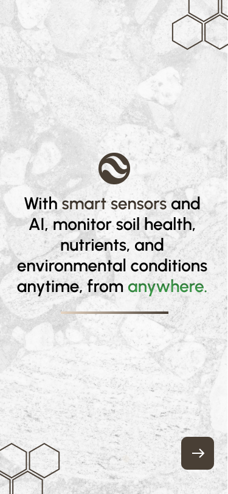
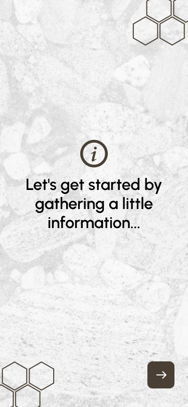

* 🔐 Sign Up / Sign In: Secure authentication pages for new and returning users.
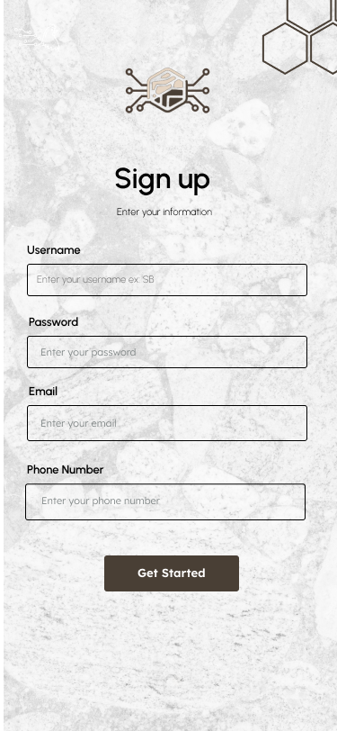
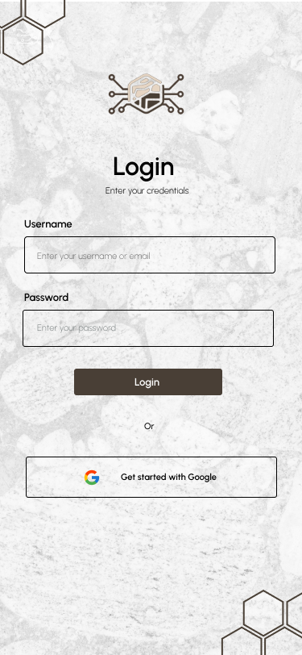

* 📊 Dashboard: A real-time overview of soil fauna data including bioacoustic activity and sensor readings.
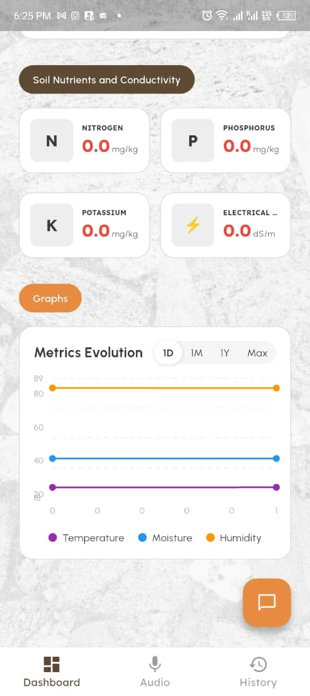
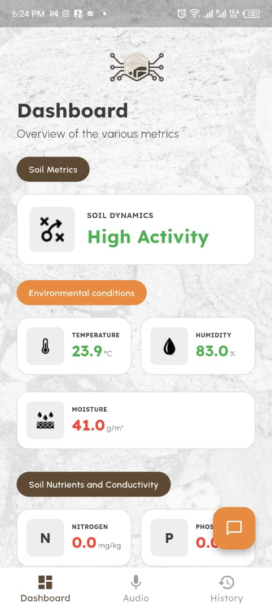

* ⬆️ Manual Upload: Manually upload audio or sensor data for analysis.
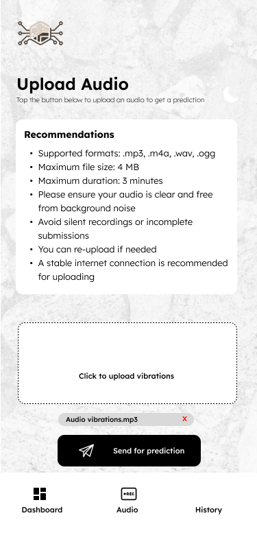
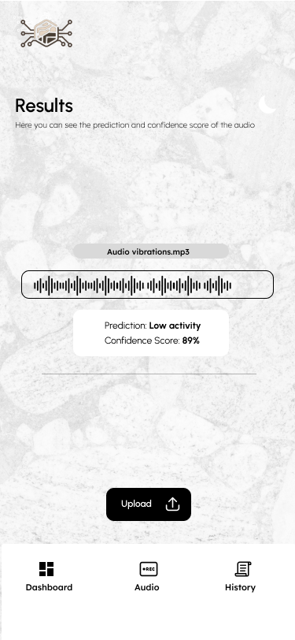

* 🤖 Chatbot: An AI-powered assistant that answers user queries about soil health and app usage.
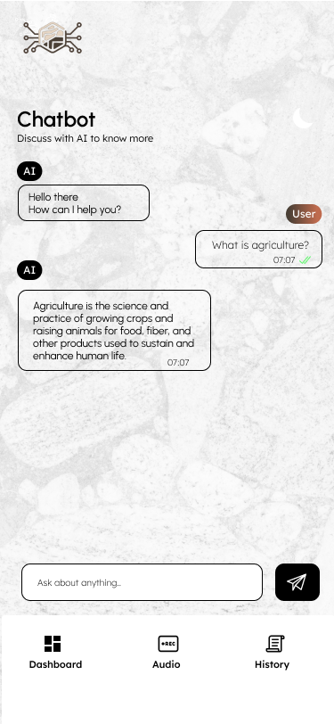

🔔 Push Notification: Real-time alerts to notify users of critical soil conditions like low fauna activity or abnormal moisture levels.
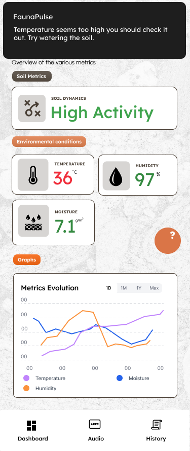

* 🕓 History: Displays historical logs of soil activity, alerts, and system responses.
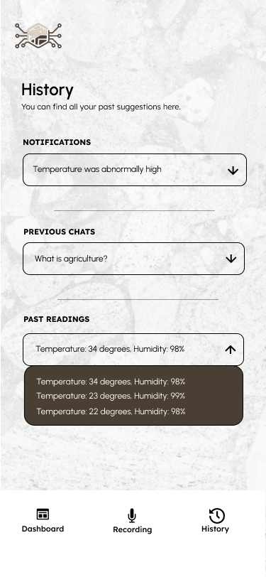

---

## 🎨 Design Prototype

🎨 [Figma File](https://www.figma.com/design/E711yGypzSbVb67xeNCud2/Fauna-Pulse?node-id=0-1&t=7Ms4QG1h1jL6bYI2-1)

---

## 📩 Contact

For questions or collaborations, feel free to reach out:

**Babalola Samuel**
📧 [s.babalola@alustudent.com](mailto:s.babalola@alustudent.com)
🔗 [LinkedIn](https://www.linkedin.com/in/sammybabs/)

